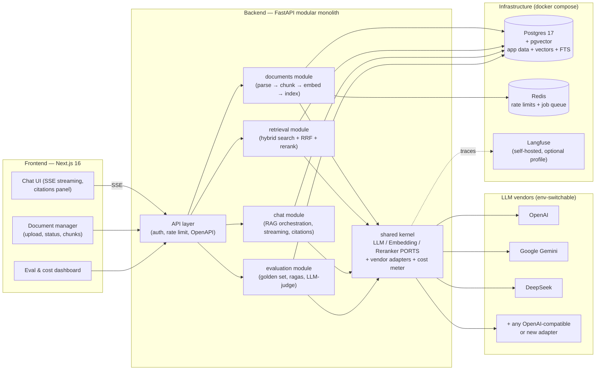
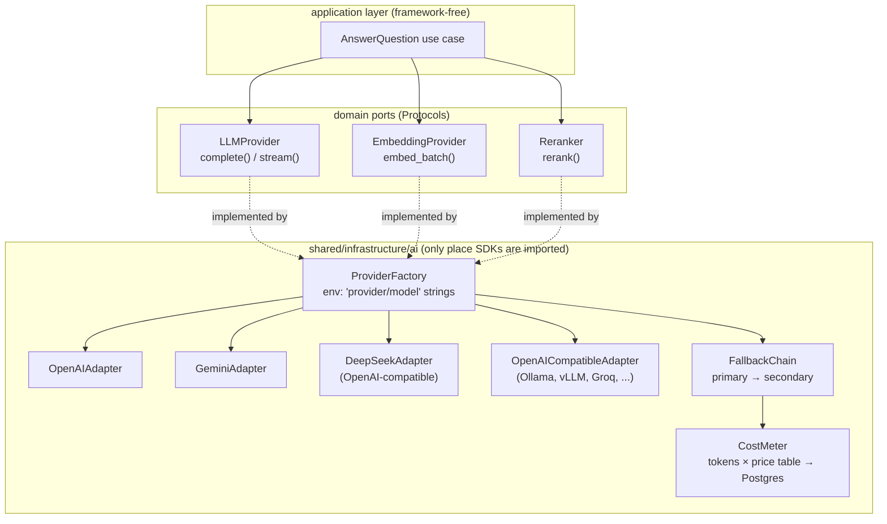
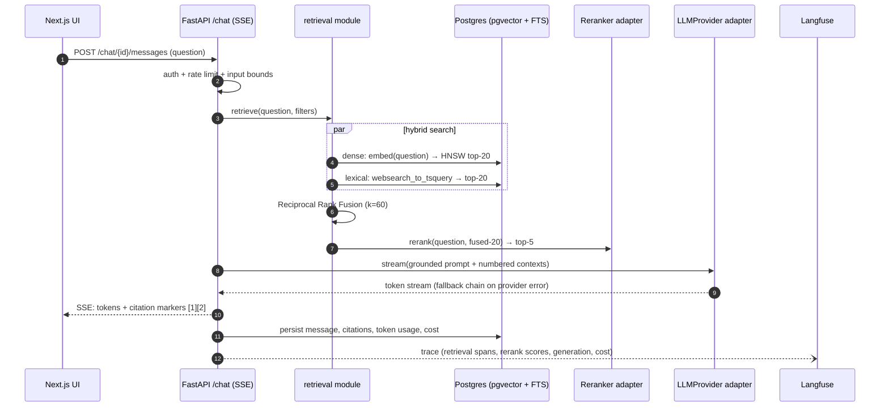
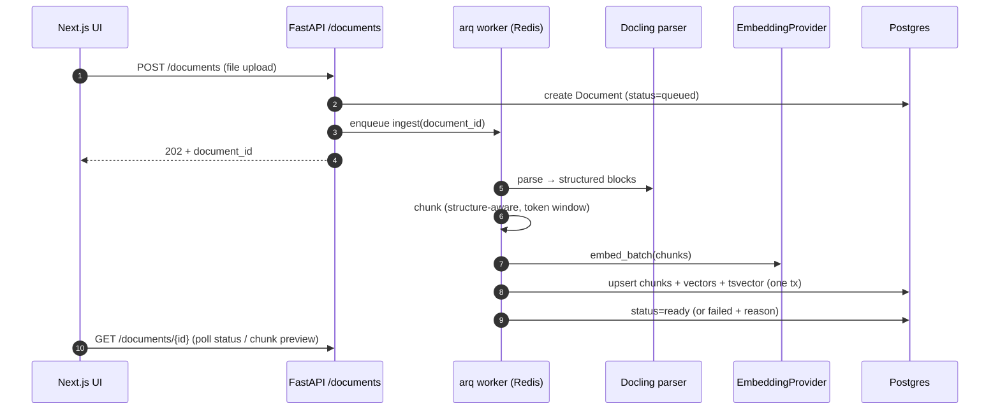
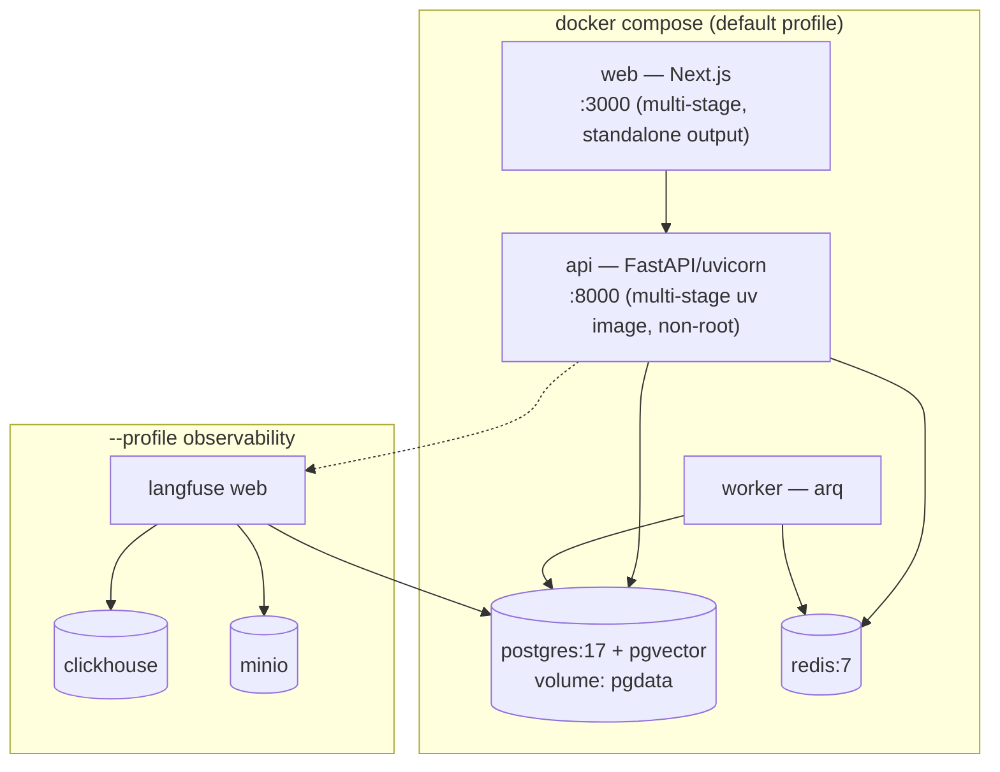

# RAG Production Platform — Architecture & Tooling Review

> **Status:** Approved & implemented (2026-08-16). This document is the blueprint the repo was built from; the code, ADRs (`docs/adr/`), and CI gates realize it. Kept as the design record — see `README.md` for the current entry point.
> **Goal:** A public, enterprise-grade RAG portfolio repo that doubles as a backend-engineering best-practices showcase, aligned with Muhammad Ridwan's CV (hybrid retrieval + RRF + cross-encoder reranking, multi-provider routing with cost tracking, LLM-as-judge evals in Langfuse, streaming chat with citations, Next.js + FastAPI).
> **Name (decided):** **Pandu** — Indonesian for *guide/scout*. Tagline: "grounded answers, guided by your documents." Repo: `pandu` (or `pandu-rag` if taken).

---

## 1. What we are building

A self-hostable **enterprise knowledge platform**: upload documents, ask questions, get streamed answers with source citations — with the production scaffolding that separates a demo from infrastructure:

| Pillar | What it means here |
|---|---|
| **Retrieval quality** | Hybrid BM25 + dense vector search, Reciprocal Rank Fusion, cross-encoder reranking |
| **Vendor independence** | OpenAI, Gemini, DeepSeek at launch; any vendor = one new adapter file (chat, embeddings, rerank are each a port) |
| **Evaluation** | Golden dataset + ragas metrics (faithfulness, answer relevancy, context precision/recall) + LLM-as-judge, gated in CI |
| **Observability** | Langfuse tracing end-to-end (query → retrieval → rerank → generation), per-call token/cost metering |
| **Governance** | API-key auth, rate limiting, prompt-injection surface hardening, counts-only logging (no prompt text in logs) |
| **Engineering discipline** | Modular monolith + clean architecture, strict typing, architecture tests in CI, testcontainers integration tests |

**Explicitly out of scope for v1** (roadmap candidates, §10): multi-tenancy/workspaces, GraphRAG, agentic multi-hop retrieval, SSO.

---

## 2. High-level architecture



Key properties:

- **One deployable backend** (modular monolith), not microservices — but module boundaries are CI-enforced (`import-linter`), so a later split is mechanical, not archaeological. This is the story to tell in the README.
- **One database.** Postgres holds relational data, vectors (pgvector), and lexical search (full-text search). Fewer moving parts, transactional consistency between chunks and their embeddings, and metadata filtering (by document, tag, date) is just SQL `WHERE`.
- **Vendor SDKs never leak** past the shared-kernel adapters. Features depend on ports (`Protocol`s), the composition root wires concrete adapters from env config.

---

## 3. Backend stack (Python)

Inherits your `python-uv-boilerplate` conventions (uv, modular monolith, strict mypy, ruff, composition root in `bootstrap.py`) and extends them.

### 3.1 Runtime & framework

| Choice | Tool | Rationale |
|---|---|---|
| Python | **3.13** | Matches boilerplate; broad wheel support for the ML deps we need |
| Package manager | **uv** (workspace mode) | Lockfile, fast CI, `dependency-groups` for dev/eval/rerank extras |
| Web framework | **FastAPI** (async) + uvicorn | OpenAPI for free, SSE streaming, your home turf |
| Settings | **pydantic-settings** | Typed env config, validated at startup, `.env.example` documented |
| ORM | **SQLAlchemy 2.0 async** + **asyncpg** | Standard; ORM models live in `infrastructure/` only, hand-written mappers to domain entities |
| Migrations | **Alembic** | One migration tree, but migration files grouped per module |
| Background jobs | **arq** (Redis) | Ingestion (parse/embed) runs async, API returns a job id + progress endpoint; arq is small, async-native, and Redis is already in compose for rate limiting |
| Domain modeling | **dataclasses** (frozen) in `domain/`, **Pydantic v2** only at edges (API schemas, DTOs, config) | Keeps the domain framework-free — the clean-architecture discipline reviewers look for |

### 3.2 RAG pipeline components

| Stage | Tool | Rationale |
|---|---|---|
| Parsing | **Docling** (IBM / Linux Foundation) | Best OSS layout fidelity in 2026 (tables, multi-column PDFs), exports structured Markdown/JSON we control; behind a `DocumentParser` port so Unstructured/LlamaParse adapters are possible |
| Chunking | Docling **HybridChunker** (structure-aware) + configurable token window/overlap | Structure-aware beats naive fixed-size; chunk params recorded per index for reproducibility |
| Embeddings | **`EmbeddingProvider` port** — adapters: OpenAI `text-embedding-3-*`, Gemini `gemini-embedding-*` | Note: DeepSeek has no embedding API — chat and embedding providers are configured independently (`AI_CHAT_MODEL`, `AI_EMBED_MODEL`), which is exactly why they are separate ports |
| Lexical search | **Postgres FTS** (`tsvector` + `ts_rank_cd`) | Zero extra services; README notes it's BM25-*like* (not exact BM25) and mentions ParadeDB `pg_search` / Qdrant as the exact-BM25 upgrade path |
| Vector search | **pgvector** (HNSW index, cosine) | See decision log §9 |
| Fusion | **Reciprocal Rank Fusion** (k=60) in SQL/service layer | The 2026 default for hybrid; hand-implemented = showcase |
| Reranking | **`Reranker` port** — **default: no-op** (hybrid+RRF straight to LLM); opt-in adapters via `RERANKER=cohere\|jina\|local`: hosted API (Cohere Rerank / Jina / Voyage) or local cross-encoder (`sentence-transformers`, BGE-reranker) | Local adapter is `uv sync --extra rerank-local` / compose `--profile rerank` so the base image stays slim (no torch); the eval dashboard reports rerank-on vs rerank-off scores, turning the toggle into evidence |
| Retrieval shape | Retrieve ~20 (fused) → rerank → top 5 → prompt | Industry rule-of-thumb; all three numbers are config |
| Generation | **`LLMProvider` port** — adapters over official SDKs: `openai`, `google-genai`, DeepSeek via OpenAI-compatible base URL | Factory + ordered **fallback chain** + per-call **cost metering** (token counts × price table) — mirrors your CV's multi-provider factory bullet |
| Agentic layer (later phase) | **pydantic-ai** | Already in your boilerplate; used for query rewriting/decomposition and the LLM-as-judge, *not* for the core pipeline — the pipeline stays framework-free so the engineering is visible |

**Why no LangChain/LlamaIndex for the pipeline:** the portfolio's point is that *you* can build retrieval; frameworks would hide exactly the parts worth showing. (Stated as an ADR in the repo — interviewers ask.)

### 3.3 Multi-vendor seam (the centerpiece)



Conventions carried over from your boilerplate's `ai.md`: models are `provider/model` env strings resolved at call time, env read lazily, every model-calling surface rate-limited and length-bounded, usage counts logged but never prompt text.

### 3.4 Query-time flow



### 3.5 Ingestion flow



---

## 4. Frontend stack (single repo, `frontend/`)

| Choice | Tool | Rationale |
|---|---|---|
| Framework | **Next.js 16** (App Router, React 19, TypeScript strict) | Your CV's stack; RSC for the document/dashboard pages, client components for chat |
| Styling / UI | **Tailwind CSS 4 + shadcn/ui** | Fast, professional look; matches CV |
| Data fetching | **TanStack Query** + typed API client **generated from the FastAPI OpenAPI schema** (`openapi-typescript`) | Contract-first: FE types drift-checked against BE in CI — a strong best-practices signal |
| Streaming | Native SSE (`fetch` + ReadableStream) with citation-marker parsing | Shows you can do streaming UIs without an SDK |
| State | TanStack Query + light Zustand where needed | No Redux ceremony |
| Testing | **Vitest** (+ Testing Library) unit, **Playwright** e2e (chat happy path, upload flow) | |
| Lint/format | **Biome** (decided) | One fast tool for format + lint (React hooks, a11y, import sorting); accepted tradeoff: no Next.js-specific or TanStack Query lint plugins |
| Package manager | **pnpm** | |

Screens: **Chat** (streamed answer, expandable source citations with chunk highlights), **Documents** (upload, ingestion status, chunk inspector), **Dashboard** (eval scores over time, cost per provider/model, latency), **Settings** (provider/model selection per workspace-of-one).

---

## 5. Repository layout

```
rag-python-production/
├── backend/                        # uv project (your boilerplate shape)
│   ├── src/app/
│   │   ├── bootstrap.py            # composition root — ALL wiring
│   │   ├── api.py                  # thin ASGI entrypoint
│   │   ├── worker.py               # arq worker entrypoint
│   │   ├── modules/
│   │   │   ├── documents/{domain,application,infrastructure,presentation}/
│   │   │   ├── retrieval/{...}/
│   │   │   ├── chat/{...}/
│   │   │   └── evaluation/{...}/
│   │   └── shared/
│   │       ├── domain/             # ports: LLMProvider, EmbeddingProvider, Reranker
│   │       └── infrastructure/ai/  # adapters, factory, fallback, cost meter
│   ├── tests/{unit,integration,contract,architecture}/
│   ├── evals/                      # golden dataset (JSONL) + ragas runner
│   ├── migrations/                 # alembic, grouped per module
│   └── pyproject.toml
├── frontend/                       # Next.js 16 app (pnpm)
├── docs/
│   ├── adr/                        # ADR-001-modular-monolith.md, ADR-002-pgvector.md, ...
│   └── diagrams/
├── docker-compose.yml              # dev: postgres, redis, api, worker, web
├── docker-compose.observability.yml# optional: langfuse stack
├── .github/workflows/{backend.yml,frontend.yml,evals.yml}
├── Makefile                        # make dev / test / evals / up
└── README.md                       # architecture story + demo GIF + eval scores
```

Two toolchains, one repo, no monorepo framework (Nx/Turbo unnecessary at this scale — an ADR explains why).

---

## 6. Dev tooling & quality gates (backend)

Your first-iteration list from claude.ai holds up well; this is the adopted subset + deltas:

| Concern | Tool | Notes |
|---|---|---|
| Lint + format | **ruff** (lint + format) | Drop black — ruff-format replaces it (your boilerplate carries both; here we simplify) |
| Types | **mypy --strict** | Boilerplate config carries over |
| Module boundaries | **import-linter** | Contracts: layer ordering per module; `modules/*` independence (cross-module only via application layer); `domain` imports no framework; SDK imports only in `shared/infrastructure/ai` |
| Architecture tests | **pytest-arch checks** live in `tests/architecture/` | import-linter first; pytest-archon only if contracts feel limited (your priority #5 — agreed) |
| Security | **bandit** + **pip-audit** + **gitleaks** (pre-commit) | pip-audit matters more post-LiteLLM-supply-chain-incident era; gitleaks because this repo is public and full of API-key env vars |
| Unit tests | **pytest** + pytest-mock, **polyfactory** for test data | Domain/application: zero I/O, fake adapters |
| Integration | **testcontainers-python** (real `pgvector/pgvector:pg17` container) | Hybrid-search SQL, HNSW behavior, migrations |
| Contract | **schemathesis** against OpenAPI | Catches schema drift the generated FE client depends on |
| Coverage | **Layered gate**: 100% on `domain/` + `application/`, ~85% overall (two `coverage report --fail-under` checks in CI) | Makes the clean-architecture claim measurable: the framework-free core is fully unit-tested; adapters are integration-tested, where a flat 100% would be dishonest |
| Hooks | **pre-commit** (ruff, mypy, import-linter, gitleaks) | |
| DI | Hand-wired in `bootstrap.py`; **dependency-injector only if wiring gets painful** | Matches your incremental priority list — don't start with the container |

**CI (GitHub Actions), per-PR:**

```
backend:  ruff check + format --check → mypy --strict → lint-imports
          → pytest tests/unit → pytest tests/integration (testcontainers)
          → pytest tests/contract → docker build
frontend: biome check → tsc --noEmit → openapi client drift check
          → vitest → playwright (on compose stack) → next build
evals:    (nightly + on-demand label) ragas suite on golden dataset
          → fail if faithfulness < 0.85 or context_precision < 0.75
          → publish scores to Langfuse + README badge
```

Eval thresholds start permissive and ratchet up — a *tightening-only* rule, stated in the ADR.

---

## 7. Evaluation & observability (the differentiator)

- **Seed corpus (decided 2026-08-16)**: **NIST SP 800-series cybersecurity publications** — public domain (US-government work, no copyright; NIST asks only for acknowledgement). Start with 4–6 PDFs: SP 800-53r5 (security & privacy controls — a huge control-catalog table set, ideal for Docling's layout showcase), SP 800-63B (digital identity/authentication), SP 800-171r3, and CSWP 29 (Cybersecurity Framework 2.0). Enterprise-realistic queries fall out naturally ("What are the MFA requirements for AAL2?", "Which controls cover audit log retention?") including cross-document ones. Redistributable in-repo with a `CORPUS_LICENSE.md` crediting NIST. **Optional secondary corpus**: GDPR + EU AI Act from EUR-Lex (CC BY 4.0 via Commission Decision 2011/833/EU) for multilingual/regulatory flavor.
- **Golden dataset**: 50–100 question/answer/source triples over that corpus, versioned in-repo as JSONL. Bootstrap candidate pairs with ragas' `TestsetGenerator`, then **human-curate every item** (the curation is the portfolio signal — synthetic-only golden sets are a known anti-pattern).
- **ragas** for batch RAG metrics (faithfulness, answer relevancy, context precision/recall) — the published-methodology standard; runs nightly in CI and on a `run-evals` PR label.
- **LLM-as-judge** (pydantic-ai, judge model env-switchable) for answer-quality rubric scoring — mirrors your 0.92-faithfulness CV story.
- **Langfuse (self-hosted)** for tracing: every chat request becomes a trace with retrieval spans (candidate sets, RRF ranks, rerank scores), generation span, token usage, and cost. Eval scores are written back to traces. Runs as an **optional compose profile** because Langfuse v3 needs ClickHouse + Redis + MinIO — the app must run fine without it (no-op tracer adapter).
- **Retrieval-only metrics** (recall@k, MRR against the golden set) run *without* any LLM — cheap, deterministic, and shows you know retrieval evaluation ≠ generation evaluation.
- **App telemetry**: structured JSON logging (structlog), request IDs, OpenTelemetry instrumentation on FastAPI + SQLAlchemy (exportable to any OTLP backend).

---

## 8. Local run & Docker deployment



- **Dev loop**: `make dev` = compose up postgres+redis, run `uvicorn --reload` and `next dev` natively (fast HMR). `make up` = full containerized stack — the "clone → `cp .env.example .env` → add one API key → `make up`" README promise.
- **Images**: multi-stage builds (uv `--frozen` install layer → slim runtime, pnpm build → Next standalone), non-root user, healthchecks, pinned digests. Optional `--extra rerank-local` build arg for the torch-enabled image.
- **12-factor config**: one `.env.example` documenting every variable (`AI_CHAT_MODEL=openai/gpt-5.2`, `AI_FALLBACK_MODEL=deepseek/deepseek-chat`, `AI_EMBED_MODEL=openai/text-embedding-3-small`, keys per vendor).
- **Not in v1**: Kubernetes manifests, Terraform. Compose is the deployment story; a `docs/deploy-cloud-run.md` sketch covers GCP (your platform) as roadmap.

---

## 9. Decision log (confirmed with you, 2026-08-16)

| # | Decision | Choice | Alternatives considered |
|---|---|---|---|
| 1 | Vector store | **pgvector** (HNSW), FTS for lexical, behind a `SearchIndex` port | Qdrant (server-side hybrid; documented as the scale-out path in ADR-002), dual-adapter from day 1 (rejected: doubles phase-1 work) |
| 2 | Multi-vendor LLM | **Custom ports + official-SDK adapters** + factory + fallback + cost meter | LiteLLM SDK (rejected as core: hides the showcase; also the Mar-2026 PyPI supply-chain incident makes "we own the seam" a good security talking point); hybrid port+LiteLLM-adapter (possible later as the long-tail adapter) |
| 3 | Scope | **Full showcase**: ingestion UI, streaming chat + citations, hybrid+rerank, evals in CI, Langfuse, cost dashboard, API-key auth | Core-first (less impressive), multi-tenancy (deferred to roadmap — biggest-bang later addition) |
| 4 | Pipeline framework | **None** (hand-built retrieval); pydantic-ai only for judge/query-rewrite | LangChain/LlamaIndex (hide the engineering, own the object model, conflict with clean-architecture dependency rule); LangGraph deferred — it solves stateful multi-actor agent orchestration, which v1's linear pipeline doesn't have (candidate for the agentic-retrieval roadmap spike) |
| 5 | Repo shape | Plain two-folder monorepo | Nx/Turborepo (overhead without payoff at this scale) |
| 6 | Golden-dataset seed corpus | **NIST SP 800-series PDFs** (public domain, credit NIST) + optional GDPR/EU AI Act (CC BY 4.0) | Kubernetes docs (CC BY 4.0, but Markdown-native — wastes the Docling PDF showcase); MS MARCO/existing QA datasets (research-only licenses or wrong shape); Indonesian tax regs (public domain locally, but Indonesian-language corpus narrows the international-reviewer audience) |
| 7 | Product name | **Pandu** (Indonesian: *guide/scout*) — carries personal identity, low GitHub collision risk | Groundwork (parseable pun, but generic word), Corpora (professional but sterile, existing projects) |
| 8 | Coverage gate | **Layered**: 100% `domain/`+`application/`, ~85% overall | Flat 90% (loses the architectural signal), flat 100% with exclusions (exclusion lists rot) |
| 9 | FE lint/format | **Biome** — one fast tool, modern-tooling signal | ESLint 9 + Prettier (Next-specific rules but slower, more config), Biome+minimal-ESLint hybrid (two toolchains to reconcile) |
| 10 | Reranker default | **No-op**, opt-in via `RERANKER=cohere\|jina\|local` — slim image, one-key quickstart, graceful degradation as a feature | Local-by-default (2–3GB torch image, slow CPU inference), hosted-by-default (second API key blocks the quickstart) |

Each becomes a real ADR file in `docs/adr/` — reviewers and interviewers genuinely read these.

---

## 10. Phased roadmap

| Phase | Deliverable | Proves |
|---|---|---|
| **0. Foundations** | Repo scaffold from boilerplate, compose (pg+redis), CI green on empty modules, import-linter contracts, ADRs 1–5 | Engineering discipline exists before features |
| **1. Ingestion** | Upload → Docling parse → chunk → embed → index; worker + status polling; documents UI | Async pipeline design |
| **2. Retrieval + Chat** | Hybrid search + RRF, SSE chat with citations, provider factory + fallback + cost meter (OpenAI, Gemini, DeepSeek) | The core RAG + the vendor seam |
| **3. Quality** | Cross-encoder/API reranking, golden dataset, ragas + retrieval metrics in CI, eval README badge | Evaluation maturity |
| **4. Observability** | Langfuse profile, traces with rerank scores, cost dashboard UI, OTel | Production operability |
| **5. Hardening** | schemathesis, Playwright e2e, gitleaks/pip-audit, rate limiting, prompt-injection tests, load-test note (locust) | Enterprise-grade claim earned |
| **Roadmap** | Multi-tenancy (workspaces, scoped keys), Qdrant adapter, query decomposition (pydantic-ai), GraphRAG spike, Cloud Run deploy guide | Growth story for the README |

Each phase = one PR train with the full gate — the git history itself becomes portfolio evidence.

---

## 11. CV alignment map

| CV claim | Where the repo proves it |
|---|---|
| "hybrid BM25 + vector, RRF, cross-encoder reranking" | `retrieval` module + integration tests + ADR |
| "multi-provider routing with cost tracking" | shared AI seam: factory, fallback chain, cost meter, dashboard |
| "LLM-as-judge, Langfuse, golden datasets" | `evaluation` module + `evals/` + CI gate + badge |
| "streaming chat UIs, source attribution" | Next.js chat + SSE + citations panel |
| "clean architecture / modular monolith" | import-linter contracts enforced in CI |
| "evals, guardrails, token-cost governance, observability as first-class" | phases 3–5 are exactly this |

---

## 12. References (research inputs)

- [RAG in Production 2026: GraphRAG, Hybrid Retrieval, and Evals](https://ailearningguides.com/rag-production-patterns-2026/) — hybrid + RRF(k=60) as the 2026 default; eval/observability/governance as the demo-vs-infrastructure line
- [RAG Best Practices 2026: Chunking, Reranking, Hybrid Search](https://www.callmissed.com/en/blog/rag-best-practices-2026) — retrieve-20/rerank-5/send-3–5 rule of thumb
- [pgvector vs Qdrant: Which Should You Use in 2026?](https://rivestack.io/blog/pgvector-vs-qdrant) and [Vector DB comparison](https://www.kalviumlabs.ai/blog/vector-databases-compared-pgvector-pinecone-qdrant-weaviate/) — pgvector correct under ~10–50M vectors when data already lives in Postgres
- [Docling vs Unstructured for RAG ingestion](https://www.file2markdown.ai/blog/docling-vs-unstructured) and [The New Stack on Docling](https://thenewstack.io/from-unstructured-data-to-rag-ready-with-docling/) — Docling as the 2026 OSS fidelity leader (Linux Foundation, Granite-Docling)
- [Ragas vs DeepEval 2026](https://qaskills.sh/blog/ragas-vs-deepeval-2026) and [LLM eval frameworks compared](https://helpmetest.com/blog/llm-evaluation-frameworks/) — ragas for batch RAG scoring on golden sets; Langfuse trace-sampling eval loop pattern
- [Best LiteLLM Alternatives for Production (2026)](https://inworld.ai/resources/best-litellm-alternatives) — LiteLLM scale concerns + Mar-2026 supply-chain incident context
- [NIST SP 800-series general information](https://www.nist.gov/itl/publications/nist-special-publication-800-series-general-information) — SP 800 publications are US-government works, not subject to copyright (attribution appreciated)
- [Kubernetes website LICENSE](https://github.com/kubernetes/website/blob/main/LICENSE) (CC BY 4.0) and [EUR-Lex reuse policy](https://en.wikipedia.org/wiki/EUR-Lex) (CC BY 4.0 per Commission Decision 2011/833/EU) — corpus alternatives considered

---

## 13. Open items

**All resolved (2026-08-16)** — see the decision log (§9, #1–#10). The blueprint was approved and implemented the same day: phases 0–3 plus the hardening test suites are in the tree (backend modules, shared AI seam, frontend, ADRs 1–10, CI with layered coverage + architecture contracts, integration/contract suites). Remaining from the roadmap (§10): Langfuse compose profile wiring end-to-end, Playwright e2e runs against a keyed stack, and the roadmap-proper items (multi-tenancy, Qdrant adapter, query decomposition, GraphRAG, Cloud Run guide).
