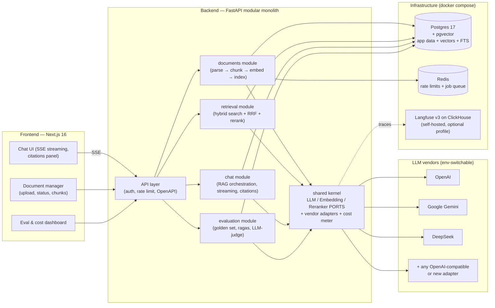
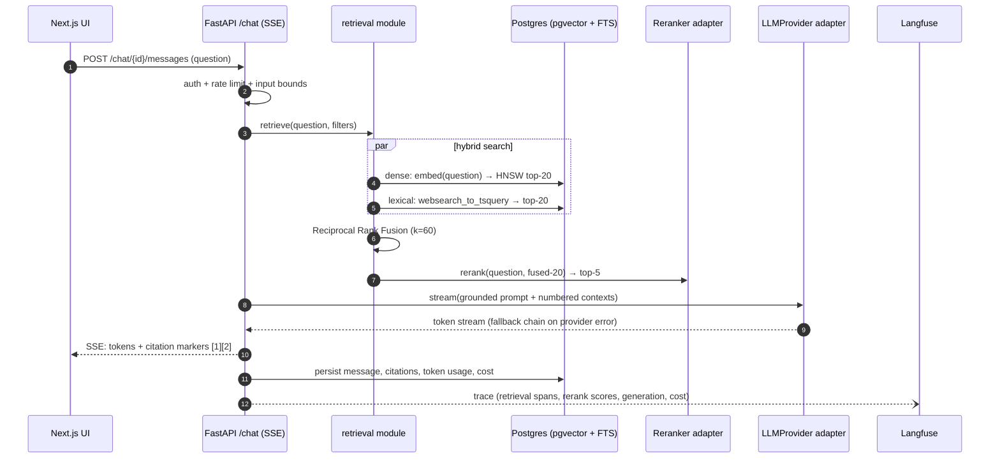

# Pandu

**Grounded answers, guided by your documents.**

[](https://github.com/ridwanspace/pandu/actions/workflows/backend.yml)
[](https://github.com/ridwanspace/pandu/actions/workflows/frontend.yml)
[](https://github.com/ridwanspace/pandu/actions/workflows/evals.yml)
[](backend/pyproject.toml)
[](frontend/)
[](LICENSE)

[](backend/)
[](frontend/)
[](docs/adr/ADR-002-pgvector-single-postgres.md)
[](backend/src/app/worker.py)
[](docker-compose.yml)
[](docker-compose.yml)

Pandu is a self-hostable enterprise RAG platform: upload documents, ask
questions, get streamed answers with source citations. It is built as a
FastAPI modular monolith with hand-implemented hybrid retrieval (dense +
lexical, RRF fusion, optional cross-encoder reranking) behind a
vendor-independent LLM seam, evaluated in CI against a human-curated golden
dataset. The intended reader is an engineer deciding whether the author can
build production AI systems — every architectural claim in this README is
enforced by a CI gate, not asserted.

*Pandu* is Indonesian for *guide* — which is a RAG system's whole job.

---

## See it running

Captured from a live local stack (Playwright + system Chrome driving the real
UI → API → Postgres → DeepSeek, no mocks):


*A cross-document question over the NIST corpus: hybrid retrieval
(pgvector + FTS + RRF, `gemini-embedding-001`) pulls four contexts spanning
**both** publications — the AU control catalog from SP 800-53r5 plus the
tailoring criteria and methodology from SP 800-171r3 — and
`deepseek-v4-flash` composes the actual control mapping (AU-01 → 03.15.01,
AU-02 → 03.03.01, AU-09 → 03.03.08) with inline [n] citations. The footer
shows tokens, metered cost, and latency for the call. Composing across two
publications is the case that
[ADR-015](docs/adr/ADR-015-lexical-arm-ranks-not-filters.md) fixed: while the
lexical arm was silently empty, one document tended to take every context
slot.*

| Documents — upload, parse, chunk, embed | Dashboard — eval metrics & live cost ledger |
|---|---|
|  |  |

*The dashboard reads the same `eval_runs` table CI gates on, so the trend line
is the real history: the August `golden_v1` runs (MRR 0.822) and the September
`golden_v2` runs after the lexical fix (`ndcg_at_k 0.925`, `mrr 0.933`,
`recall_at_k 0.967`), plus the abstention row where
`false_abstention_rate 0.267 ↓` replaced the earlier 0.400.*


*The same request in the self-hosted Langfuse (v3 on ClickHouse,
`docker compose --profile observability up`): one `chat.ask` trace with the
`retrieval.embed → search → rerank` span waterfall. The metadata panel shows
what the tracer is allowed to record — model ids, candidate counts, RRF
constant, latencies. Input/output are empty by design: prompt and document
text never leave the app, and token costs live in Pandu's own metering
ledger (dashboard above), not the tracing backend.*

## Why this repo looks the way it does

Anyone can wire a vector store to an LLM in an afternoon. The difference
between that demo and infrastructure is everything around the pipeline:

| Pillar | What it means here |
|---|---|
| **Retrieval quality** | Hybrid BM25-like + dense vector search, Reciprocal Rank Fusion, cross-encoder reranking |
| **Vendor independence** | OpenAI, Gemini, DeepSeek at launch; any vendor = one new adapter file (chat, embeddings, rerank are each a port) |
| **Evaluation** | Golden dataset **with negatives** + rank metrics (recall/precision/hit-rate/MRR/nDCG at k=1,3,5,10) + measured abstention + LLM-as-judge, gated in CI **on both thresholds and regressions** |
| **Observability** | Langfuse tracing end-to-end (query → retrieval → rerank → generation), per-call token/cost metering |
| **Governance** | API-key auth, rate limiting, prompt-injection surface hardening, counts-only logging (no prompt text in logs) |
| **Engineering discipline** | Modular monolith + clean architecture, strict typing, architecture tests in CI, testcontainers integration tests |

Every non-obvious decision has an [ADR](docs/adr/). The fourteen that shaped
the system: [multi-provider seam](docs/adr/ADR-001-multi-provider-seam.md),
[pgvector](docs/adr/ADR-002-pgvector-single-postgres.md),
[scope](docs/adr/ADR-003-full-showcase-scope.md),
[no RAG framework](docs/adr/ADR-004-no-rag-framework.md),
[repo shape](docs/adr/ADR-005-plain-two-folder-monorepo.md),
[corpus](docs/adr/ADR-006-nist-seed-corpus.md),
[name](docs/adr/ADR-007-name-pandu.md),
[coverage gate](docs/adr/ADR-008-layered-coverage-gate.md),
[Biome](docs/adr/ADR-009-biome-frontend-toolchain.md),
[reranker default](docs/adr/ADR-010-reranker-default-noop.md),
[abstention](docs/adr/ADR-011-abstention-as-a-measured-output.md),
[metrics & diffing](docs/adr/ADR-012-retrieval-metrics-and-regression-diffing.md),
[optional Qdrant](docs/adr/ADR-013-optional-qdrant-adapter.md),
[citation validation](docs/adr/ADR-014-citation-validation-is-code.md).

## Architecture

One deployable backend — a modular monolith, not microservices — but the
module boundaries are CI-enforced with import-linter, so a later split is
mechanical, not archaeological. One database: Postgres holds relational
data, vectors (pgvector), and lexical search (FTS), which buys
transactional consistency between chunks and their embeddings, and makes
metadata filtering a SQL `WHERE` clause.



A question travels through the system like this:



Diagram sources (including ingestion and the provider seam) live in
[`docs/diagrams/`](docs/diagrams/).

### The multi-vendor seam

The centerpiece of the backend. Chat, embeddings, and reranking are three
separate domain ports (`Protocol`s) — separate because vendors are
asymmetric (DeepSeek has no embedding API). Vendor SDKs are imported in
exactly one package, `shared/infrastructure/ai/`, and import-linter fails
CI if they appear anywhere else. A factory resolves `provider/model` env
strings at call time, a fallback chain fails over on provider errors, and a
cost meter records token counts × a price table into Postgres on every
call.

Adding a vendor is one adapter file. Nothing above the ports changes — and
that is a tested property of the codebase, not a diagram aspiration. No
LiteLLM: a gateway SDK would hide exactly the engineering this repo exists
to show, and after the March 2026 supply-chain incident, owning the seam
that all API keys flow through is also the safer posture
([ADR-001](docs/adr/ADR-001-multi-provider-seam.md)).

### The retrieval pipeline

Hand-built, no framework ([ADR-004](docs/adr/ADR-004-no-rag-framework.md)):

1. **Hybrid search** — the question is embedded and run against a pgvector
   HNSW index (cosine) while, in parallel, Postgres full-text search ranks
   the same corpus lexically. ~20 candidates each side.
2. **Reciprocal Rank Fusion** (k=60) merges the two rankings. RRF consumes
   ranks, not scores, so the two subsystems never need score calibration.
3. **Optional rerank** — a cross-encoder (Cohere, Jina, or a local BGE
   model) reorders the fused candidates. Off by default so the quickstart
   needs one API key, not two; `make sweep` measures exactly what turning it
   on buys, in quality *and* in added latency
   ([ADR-010](docs/adr/ADR-010-reranker-default-noop.md)).
4. **Top 5** contexts go into a grounded prompt with numbered sources; the
   answer streams back with inline `[1][2]` citations.

All the numbers (20, 60, 5) are config, not constants.

**Honest caveat:** Postgres FTS is BM25-*like*, not BM25 — `ts_rank_cd`
lacks true term saturation and length normalization. For a fused pipeline
at this scale the difference is marginal, but the exact-BM25 upgrade path
(ParadeDB `pg_search`, or a Qdrant adapter behind the same `SearchIndex`
port) is documented in [ADR-002](docs/adr/ADR-002-pgvector-single-postgres.md).

## Quickstart

Prerequisites: Docker + Compose. **No API key is required for the demo** —
the offline providers (`mock/extractive` chat + `hash/ngram` embeddings) run
the whole pipeline deterministically; add one real provider key when you
want actual generation quality.

```bash
git clone https://github.com/ridwanspace/pandu && cd pandu
cp .env.example .env          # zero-key demo works as-is;
                              # for real models set AI_CHAT_MODEL + one provider key
make up                       # full stack: web :3000, api :8000, worker, postgres, redis
./scripts/fetch_corpus.sh     # optional: pull the NIST demo corpus (public domain)
```

The mock chat provider extracts and cites the retrieved context verbatim —
grounded and deterministic by construction, and clearly labelled
`mock/extractive` in the usage footer. It demos the platform (ingestion,
hybrid retrieval, SSE streaming, citations, cost metering), not LLM quality.

Open http://localhost:3000, upload PDFs (or the fetched corpus), wait for
ingestion to report `ready`, and ask questions. The API is self-documenting
at http://localhost:8000/docs; requests need the `X-API-Key` header from
your `.env`.

The demo corpus is four NIST cybersecurity publications — public-domain US
government works chosen because their table-dense PDFs are a genuine
parsing stress test and produce enterprise-realistic questions ("What are
the MFA requirements for AAL2?"). See [docs/corpus.md](docs/corpus.md) and
[CORPUS_LICENSE.md](CORPUS_LICENSE.md).

Langfuse tracing is an optional profile — the app runs fine without it via
a no-op tracer:

```bash
make observability   # self-hosted Langfuse v3 (ClickHouse + MinIO) on :3001
uv sync --extra observability   # in backend/
```

First boot headlessly provisions a local org/project with demo keys
(`pk-lf-pandu-local` / `sk-lf-pandu-local` — they authenticate only against
your own container; nothing here talks to Langfuse Cloud). Put them in
`.env` as `LANGFUSE_PUBLIC_KEY`/`LANGFUSE_SECRET_KEY`, restart the API, and
every chat request appears as a `chat.ask` trace with retrieval span
timings — metrics and ids only, never prompt or document text.

## Dev loop and quality gates

```bash
make infra        # postgres + redis only
make dev          # migrations + uvicorn --reload (fast native loop)
make worker       # arq ingestion worker
make web          # next dev
make test         # the fast gate: lint + type + arch + unit
```

The claim "clean architecture" is cheap; these gates make it measurable:

| Gate | Tooling | The claim it enforces |
|---|---|---|
| `make lint` | ruff (lint + format) + bandit | One consistent, audited style |
| `make type` | `mypy --strict` | Full static typing, no escapes |
| `make arch` | import-linter | Layer order per module; modules independent (cross-module only via application layer); `domain/` imports no framework; vendor SDKs only in `shared/infrastructure/ai` |
| `make unit` | pytest + hand-written fakes | Domain + application run with zero I/O |
| `make integration` | testcontainers (`pgvector/pgvector:pg17`) | Hybrid-search SQL, HNSW behavior, and migrations tested against real Postgres |
| `make contract` | schemathesis | The OpenAPI schema the generated TS client depends on cannot drift |
| `make coverage` | two `--fail-under` checks | **Layered gate: 100% on `domain/` + `application/`, 85% overall** |
| `make evals-retrieval` | golden set, no LLM | Rank quality + **fails on regression vs the last run**, not just on thresholds |
| `make sweep` | golden set, no LLM | What each retrieval arm and the reranker actually buy |

The layered coverage gate is the architectural claim in numeric form: the
framework-free core is *fully* unit-tested, while adapters are
integration-tested — where a flat 100% would be dishonest
([ADR-008](docs/adr/ADR-008-layered-coverage-gate.md)).

CI runs the same gates per PR:

```
backend:  ruff check + format --check → mypy --strict → lint-imports
          → pytest tests/unit → pytest tests/integration (testcontainers)
          → pytest tests/contract → docker build
frontend: biome check → tsc --noEmit → openapi client drift check
          → vitest → playwright (on compose stack) → next build
evals:    (manual / `run-evals` label) ingest corpus → rank metrics on golden set
          → fail if recall@5 < 0.60 (thresholds ratchet, never loosen)
          → fail on ANY per-metric regression vs the previous run (--compare)
          → config sweep: hybrid vs dense vs lexical, k=1/3/5/10 (reported, not gated)
```

## Evaluation

Evaluation is the differentiator between "it seems to work" and "it works,
and here is by how much."

**Measured on the NIST corpus** — `golden_v2`, 2026-09-06,
`gemini-embedding-001` embeddings, hybrid + RRF, no reranker, 1826 chunks
across the four NIST publications, 15 answerable examples + 5 negatives:

| Metric | k=1 | k=3 | **k=5** | k=10 | Gate |
|---|---|---|---|---|---|
| recall@k | 0.833 | 0.867 | **0.967** | 0.967 | ≥ 0.60 |
| precision@k | 0.933 | 0.778 | **0.680** | 0.540 | — |
| MRR | 0.933 | 0.933 | **0.947** | 0.947 | — |
| nDCG@k | 0.933 | 0.876 | **0.920** | 0.920 | — |
| hit-rate@k | 0.933 | 0.933 | **1.000** | 1.000 | — |

Superseded the 2026-09-02 run (nDCG@5 0.897, MRR 0.889): those numbers were
taken while the lexical arm silently returned nothing on 14 of 20 questions,
so "hybrid" was measuring dense-only. See
[ADR-015](docs/adr/ADR-015-lexical-arm-ranks-not-filters.md). Precision@5
fell 0.760 → 0.680 in the same change — the real cost of a live lexical arm.

| Abstention (LLM-free scoring) | Score | Gate |
|---|---|---|
| abstention recall (negatives correctly declined) | **1.000** | ≥ 0.60 |
| false abstention rate (answerable wrongly declined) | **0.267** ↓ | — |

| LLM-as-judge (`deepseek-v4-flash`, 15 answerable) | Score | Gate |
|---|---|---|
| faithfulness | **0.810** | ≥ 0.85 — **FAILING** |
| answer relevancy | **0.847** | — |

Both tracks were re-run after the lexical fix. **False abstention fell 0.400 →
0.267** — 4 of 15 answerable questions wrongly declined instead of 6, because
better-ranked context gives the model less reason to refuse. **Faithfulness did
not follow: 0.798 → 0.810, still under the 0.85 gate** (and it moves ±0.02
between runs on judge nondeterminism alone). That is worth stating plainly —
the retrieval fix was expected to help here and essentially did not, which
means the cross-document problem below is its own defect rather than a
downstream symptom of the dead lexical arm.

**The faithfulness gate is currently red, and it is staying red.** The
tightening-only rule means a threshold may be raised, never lowered, so a
failing gate is a bug report rather than a number to edit. Splitting the run
by example type says exactly what the bug is:

| Example type | n | mean faithfulness |
|---|---|---|
| single-source | 11 | **0.870** (would pass) |
| cross-document | 3 | **0.543** |

Re-measured 2026-09-06 after the lexical fix (previously 0.868 / 0.577 — the
split barely moved, which is the point: this defect is not the dead lexical
arm). One single-source example is missing from the split because the judge
returned an empty completion on it after four retries; three cross-document
examples is a small enough n that individual verdicts swing hard
(`cross-audit-53-171` scored 1.000 in this run, 0.200 for `cross-csf-800-53`),
so read the gap as a direction, not a precise quantity.

Per-document distribution of the retrieved contexts, all three
cross-document questions, measured 2026-09-06:

```
cross-audit-53-171   top_k= 5: {800-53r5: 2, 800-171r3: 3}   <- both sources
cross-csf-800-53     top_k= 5: {800-53r5: 3, csf-2.0:   2}   <- both sources
cross-mfa-171-63b    top_k= 5: {800-63b:  5}                 <- one document
                     top_k=10: {800-63b:  9, 800-171r3: 1}      takes every slot
```

The monopolisation is real but **specific, not general**: two of the three now
split cleanly across both publications, and only `cross-mfa-171-63b` starves its
second source. SP 800-171's `§ 03.05.03 Multi-Factor Authentication` is in the
corpus and exactly on point, but both arms rank 800-63B above it — the question
is *about* authentication assurance levels, and 800-63B is the authentication
document. That is a ranking failure, not a slot-allocation failure.

The distinction decides the fix. **Per-document context caps were the obvious
answer, and measuring them killed the idea**: every cap value trades recall
(0.967 → 0.933) and hit-rate (1.000 → 0.933) away to gain that one question, and
pulls more documents into the negatives, which pushes false abstention the wrong
way. Rejected with the numbers in
[ADR-015](docs/adr/ADR-015-lexical-arm-ranks-not-filters.md) rather than shipped
on the strength of a plausible hypothesis.

Note what the diagnosis required: `recall@5 = 0.967` is blind to this, because it
credits sources that were found. Faithfulness caught that the answer could not be
composed from what reached the prompt. Two metrics disagreeing is the system
working. What remains is query decomposition for multi-source questions, or a
diversity term inside the fusion score rather than a filter after it — real work,
not being done under cover of a relaxed gate.

**Read these numbers with the caveats they earn.** `recall@5 = 0.967` is the
weakest claim in the table: 12 of the 15 answerable examples have a single
source file, so at k=5 it is close to a hit rate — "did the right document
appear anywhere in five slots". The metrics that carry information are the
ones that can fall:

- **precision@k peaks at k=1 (0.933) and decays to 0.540 at k=10.** Past the
  first few contexts we are mostly feeding the model noise. Retrieving wide is
  cheap; *prompting* wide is not.
- **recall@1 is 0.833 against recall@5 of 0.967.** The evidence is being found
  and then ranked below position 1 — textbook conditions for reranking to pay.
  It did not (see the sweep below), which is a measurement, not an assumption.
  The gap narrowed from 0.767→0.833 with the lexical fix, so there is less left
  for a reranker to recover than there was.
- **abstention recall of 1.000 looks perfect and is not the whole story.**
  The system declined all 5 negatives — and *also* declined 4 of the 15
  answerable questions (`false_abstention_rate = 0.267`, down from 0.400 before
  the lexical fix). A single combined abstention score would have reported this
  system as flawless. Reporting both directions is what makes it visible, and
  the false-abstention rate is still the number to attack next.

- **Golden dataset** — `golden_v2.jsonl`: 15 answerable
  question/answer/source triples over the NIST corpus **plus 5 negatives**,
  versioned as JSONL in `backend/evals/`. Candidates are bootstrapped with
  ragas' `TestsetGenerator`, then **every item is human-curated** —
  synthetic-only golden sets are a known anti-pattern.
- **Retrieval metrics ≠ generation metrics.** recall@k, precision@k,
  hit-rate@k, MRR and nDCG@k run against the golden set with *no LLM at all*
  — deterministic and nearly free, so they run on every push. Generation
  quality (faithfulness, answer relevancy, context precision/recall) costs
  tokens and runs on demand — `workflow_dispatch` or a `run-evals` PR label.
  (The nightly cron is disabled: a fresh service container has no stored
  baseline for `--compare` to diff against, so it could only ever fail.)
- **Reported at k = 1, 3, 5, 10.** A single k hides the diagnosis: the gap
  between recall@1 and recall@5 is precisely the signal that says *retrieval
  finds it but ranks it badly*, which is the condition under which reranking
  pays for its latency.
- **Abstention is measured, not prompted.** The golden set carries negatives
  — questions the corpus genuinely cannot answer — and the eval reports two
  error directions separately: `abstention_recall` (of the negatives, how
  many were correctly declined) and `false_abstention_rate` (of the
  answerable, how many were needlessly declined). Without negatives a system
  that answers *everything* confidently scores identically to one that
  declines correctly, and a single combined number would let a system that
  refuses everything look perfect
  ([ADR-011](docs/adr/ADR-011-abstention-as-a-measured-output.md)).
- **Citations are verified in code, not requested in a prompt.** Every
  marker in an answer must correspond to a retrieved context; violations are
  counted onto the trace. The check is structural — it proves a citation
  points at a chunk that was really retrieved, *not* that the chunk supports
  the claim ([ADR-014](docs/adr/ADR-014-citation-validation-is-code.md)).
- **Thresholds ratchet.** CI fails below recall@5 0.60 / faithfulness 0.85 /
  context precision 0.75 / abstention recall 0.60, under a
  **tightening-only rule**: they may be raised, never lowered. A regression
  means fixing the change, not the gate.
- **The gate also diffs.** `--compare` compares a run against the previous
  stored run of the same dataset version and **fails on any per-metric
  regression, even when every absolute threshold passes** — because a mean
  can hold still while some examples break and others improve. The aggregate
  lies; the diff does not
  ([ADR-012](docs/adr/ADR-012-retrieval-metrics-and-regression-diffing.md)).
- **Rerank on vs off** — and hybrid vs dense-only vs lexical-only — is
  measured by `make sweep`, turning config toggles into evidence rather than
  claims. The results are below, including the ones that contradict the
  design.

### What the sweep actually found

`make sweep` on the corpus above, 15 answerable examples, k=5:

| Configuration | recall@5 | precision@5 | MRR | nDCG@5 | latency |
|---|---|---|---|---|---|
| **hybrid + RRF** (the default) | 0.967 | 0.680 | **0.947** | **0.920** | 484 ms |
| dense only | 0.967 | **0.747** | 0.900 | 0.906 | 500 ms |
| lexical only | 0.733 | 0.440 | 0.658 | 0.641 | 485 ms |
| hybrid + Cohere `rerank-v3.5` | 0.933 | 0.733 | 0.922 | 0.892 | 1803 ms |
| hybrid + Jina `v2-base-multilingual` | 0.900 | 0.667 | 0.822 | 0.814 | 1692 ms |

Three findings, one of them a bug this sweep is what caught:

1. **The lexical arm was returning nothing at all, and every aggregate looked
   plausible anyway.** `websearch_to_tsquery` ANDs every term, so a whole
   question demanded that one 512-token chunk contain all nine of
   {multi-factor, authent, requir, sp, 800-171, relat, assur, level, 800-63b}.
   **14 of 20 golden questions returned zero lexical rows.** RRF fusing an
   empty arm is not an error — it just returns the dense ranking — so hybrid
   search ran as dense-only in production with every test, contract and type
   check green. The earlier reading of this table ("hybrid loses to dense
   because Postgres FTS is a weak leg") was measuring a dead arm and calling
   it a finding about fusion.
   [ADR-015](docs/adr/ADR-015-lexical-arm-ranks-not-filters.md) has the
   diagnosis; the fix relaxes the parsed tsquery's top-level `&` to `|` so the
   arm ranks instead of filters, keeping phrase and negation handling intact.
2. **With the arm alive, hybrid beats dense — which is what it was always
   supposed to do.** nDCG 0.920 vs 0.906 and MRR 0.947 vs 0.900 at k=5, and
   the gap is widest where it matters most: at k=1 hybrid scores nDCG 0.933
   against dense's 0.800. Chunks that both arms agree on now compound under
   RRF, which is the entire premise of hybrid retrieval.
   Precision@5 falls 0.760 → 0.680 — the honest cost of a live lexical arm
   promoting vocabulary matches that are not the best answer.
3. **Reranking made retrieval worse, and cost ~1.2 s per query.** Cohere
   nudged MRR up (0.889 → 0.922 — it *does* sharpen the top position) but
   dropped recall, precision and nDCG; Jina lost on every metric. This is
   exactly the situation [ADR-010](docs/adr/ADR-010-reranker-default-noop.md)
   assumed without proof when it defaulted the reranker to a no-op. The
   default was right, and now it is right *for a measured reason*.
   (Reranker rows predate the lexical fix and are due a re-run.)

**The lesson worth more than the numbers.** A silently-empty arm is the
failure mode a coverage gate cannot see: nothing threw, nothing regressed,
and the eval suite dutifully reported an aggregate that was *explainable*.
It stayed hidden because the integration test asserted AND semantics as the
specification — the bug was pinned as intent. What caught it was reading
per-arm provenance on one question (`dense_rank=1, lexical_rank=None`, on
every candidate) rather than trusting the mean. The regression test now sends
a full natural-language sentence and asserts the arm is non-empty.

- **Langfuse** (optional compose profile — v3 needs ClickHouse + MinIO)
  gives every chat request a full trace: candidate sets, RRF ranks, rerank
  scores, generation span, token usage, cost. Eval scores are written back
  to traces.

## Repo tour

```
├── backend/                        # uv project, Python 3.13
│   ├── src/app/
│   │   ├── bootstrap.py            # composition root — ALL wiring lives here
│   │   ├── api.py                  # thin ASGI entrypoint
│   │   ├── worker.py               # arq worker entrypoint
│   │   ├── modules/                # each: domain/ application/ infrastructure/ presentation/
│   │   │   ├── documents/          # upload → Docling parse → chunk → embed → index
│   │   │   ├── retrieval/          # hybrid search + RRF + rerank
│   │   │   ├── chat/               # RAG orchestration, SSE streaming, citations
│   │   │   └── evaluation/         # golden set, ragas, LLM-judge
│   │   └── shared/
│   │       ├── domain/             # ports: LLMProvider, EmbeddingProvider, Reranker, ...
│   │       └── infrastructure/ai/  # the ONLY place vendor SDKs are imported
│   ├── tests/{unit,integration,contract,architecture}/
│   ├── evals/                      # golden dataset (JSONL) + corpus + runners
│   │   ├── run.py                  #   thresholds + `--compare` regression diff
│   │   ├── sweep.py                #   hybrid/dense/lexical × rerank × k evidence
│   │   └── ingest_corpus.py        #   load the corpus without API/worker/Redis
│   └── migrations/                 # alembic, grouped per module
├── frontend/                       # Next.js 16 · TS strict · Tailwind 4 + shadcn/ui · Biome
├── docs/
│   ├── adr/                        # the decision log, one ADR per decision
│   ├── diagrams/                   # mermaid sources
│   ├── corpus.md                   # corpus story + golden-set methodology
│   └── deploy-cloud-run.md         # GCP deployment sketch (roadmap)
├── scripts/fetch_corpus.sh         # NIST corpus fetcher
├── docker-compose.yml              # postgres + redis (+ profiles: app · observability/Langfuse)
├── Makefile                        # the whole dev interface — `make help`
└── .github/workflows/              # backend.yml · frontend.yml · evals.yml
```

The frontend consumes a TypeScript client **generated from the FastAPI
OpenAPI schema** — contract-first, drift-checked in CI — and implements SSE
streaming with citation-marker parsing on native `fetch` + ReadableStream,
no SDK.

## Roadmap

| Phase | Deliverable | Proves |
|---|---|---|
| 0 | Scaffold, compose, CI green, import-linter contracts, ADRs | Discipline exists before features |
| 1 | Ingestion pipeline + worker + documents UI | Async pipeline design |
| 2 | Hybrid retrieval + RRF, SSE chat with citations, provider factory + fallback + cost meter | The core RAG + the vendor seam |
| 3 | Reranking, golden dataset, ragas + retrieval metrics in CI | Evaluation maturity |
| 4 | Langfuse traces, cost dashboard, OpenTelemetry | Production operability |
| 5 | schemathesis, Playwright e2e, security scans, rate limiting, prompt-injection tests | The "enterprise-grade" claim, earned |

The Qdrant `SearchIndex` adapter now exists and ships **off by default**
(`SEARCH_INDEX=pg`) — built to demonstrate that the port is real rather than
to change the deployment, and honest about replacing only the dense arm since
Qdrant's core API has no BM25
([ADR-013](docs/adr/ADR-013-optional-qdrant-adapter.md)).

**Next, and named by a measurement rather than a hunch:**

1. **Faithfulness, still 0.810 against a 0.85 gate.** Re-measured after the
   lexical fix and it barely moved (0.798 → 0.810), which rules out the dead
   lexical arm as the cause and leaves the cross-document case above as the
   real one. Per-document caps are measured and rejected (ADR-015); what is
   left is query decomposition for multi-source questions, or a diversity term
   inside the fusion score rather than a filter applied after it.
2. **Reduce the 0.267 false-abstention rate.** Down from 0.400 with the
   lexical fix — the system still declines 4 of 15 answerable questions, which
   is safe but not useful.
3. **Re-run the reranker sweep.** Those rows were measured against a
   dense-only baseline; the reranker's value proposition changes now that the
   unreranked baseline is stronger (nDCG 0.897 → 0.920).
4. **Per-example regression diffing.** The current diff is per-metric; it sees
   that something moved, not which question broke.

Beyond that: multi-tenant workspaces, a closed-set abstention label on the
response schema, query decomposition (pydantic-ai), a GraphRAG spike, and the
[Cloud Run deployment guide](docs/deploy-cloud-run.md).

## About

Built by **Muhammad Ridwan** as a working demonstration of production RAG
engineering — the systems described on the CV run here, in public, behind
CI gates. The mapping from claim to code is §11 of
[ARCHITECTURE_REVIEW.md](ARCHITECTURE_REVIEW.md), which also records the
full architecture rationale this repo was built from.

MIT licensed ([LICENSE](LICENSE)). Corpus licensing in
[CORPUS_LICENSE.md](CORPUS_LICENSE.md). Contributions welcome — see
[CONTRIBUTING.md](CONTRIBUTING.md).
