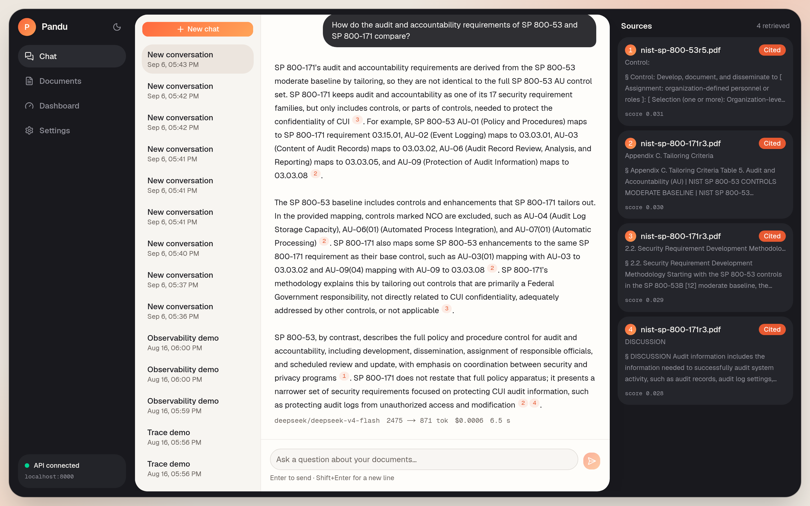
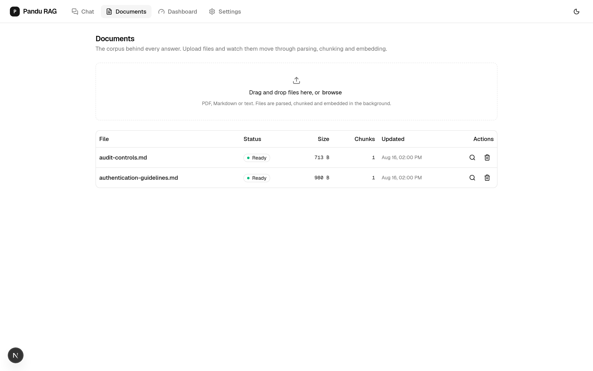
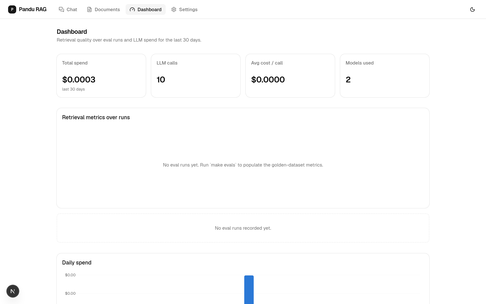
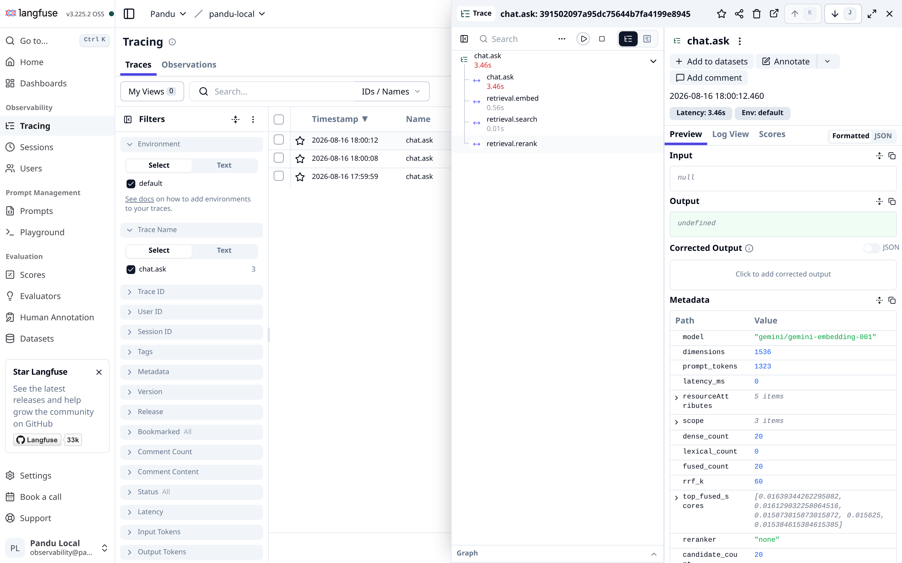
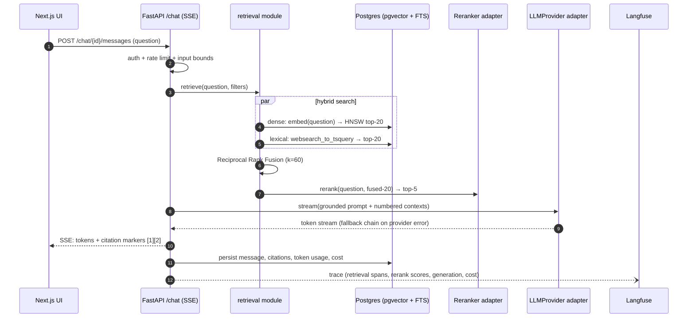

# Pandu

**Grounded answers, guided by your documents.**

[](https://github.com/ridwanspace/pandu/actions/workflows/backend.yml)
[](https://github.com/ridwanspace/pandu/actions/workflows/frontend.yml)
[](https://github.com/ridwanspace/pandu/actions/workflows/evals.yml)
[](backend/pyproject.toml)
[](frontend/)
[](LICENSE)

[](backend/)
[](frontend/)
[](docs/adr/ADR-002-pgvector-single-postgres.md)
[](backend/src/app/worker.py)
[](docker-compose.yml)
[](docker-compose.yml)

Pandu is a self-hostable enterprise RAG platform: upload documents, ask
questions, get streamed answers with source citations. It is built as a
FastAPI modular monolith with hand-implemented hybrid retrieval (dense +
lexical, RRF fusion, optional cross-encoder reranking) behind a
vendor-independent LLM seam, evaluated in CI against a human-curated golden
dataset. The intended reader is an engineer deciding whether the author can
build production AI systems — every architectural claim in this README is
enforced by a CI gate, not asserted.

*Pandu* is Indonesian for *guide* — which is a RAG system's whole job.

---

## See it running

Captured from a live local stack (Playwright + system Chrome driving the real
UI → API → Postgres → DeepSeek, no mocks):



*A cross-document question over the NIST corpus: hybrid retrieval
(pgvector + FTS + RRF, `gemini-embedding-001`) surfaces §4.2.3
Reauthentication from SP 800-63B and control AU-11 from SP 800-53r5;
`deepseek-v4-flash` answers grounded with inline [n] citations, and the
footer shows tokens, metered cost, and latency for the call.*

| Documents — upload, parse, chunk, embed | Dashboard — eval metrics & live cost ledger |
|---|---|
|  |  |



*The same request in the self-hosted Langfuse (v3 on ClickHouse,
`docker compose --profile observability up`): one `chat.ask` trace with the
`retrieval.embed → search → rerank` span waterfall. The metadata panel shows
what the tracer is allowed to record — model ids, candidate counts, RRF
constant, latencies. Input/output are empty by design: prompt and document
text never leave the app, and token costs live in Pandu's own metering
ledger (dashboard above), not the tracing backend.*

## Why this repo looks the way it does

Anyone can wire a vector store to an LLM in an afternoon. The difference
between that demo and infrastructure is everything around the pipeline:

| Pillar | What it means here |
|---|---|
| **Retrieval quality** | Hybrid BM25-like + dense vector search, Reciprocal Rank Fusion, cross-encoder reranking |
| **Vendor independence** | OpenAI, Gemini, DeepSeek at launch; any vendor = one new adapter file (chat, embeddings, rerank are each a port) |
| **Evaluation** | Golden dataset + ragas metrics (faithfulness, answer relevancy, context precision/recall) + LLM-as-judge, gated in CI |
| **Observability** | Langfuse tracing end-to-end (query → retrieval → rerank → generation), per-call token/cost metering |
| **Governance** | API-key auth, rate limiting, prompt-injection surface hardening, counts-only logging (no prompt text in logs) |
| **Engineering discipline** | Modular monolith + clean architecture, strict typing, architecture tests in CI, testcontainers integration tests |

Every non-obvious decision has an [ADR](docs/adr/). The ten that shaped the
system: [multi-provider seam](docs/adr/ADR-001-multi-provider-seam.md),
[pgvector](docs/adr/ADR-002-pgvector-single-postgres.md),
[scope](docs/adr/ADR-003-full-showcase-scope.md),
[no RAG framework](docs/adr/ADR-004-no-rag-framework.md),
[repo shape](docs/adr/ADR-005-plain-two-folder-monorepo.md),
[corpus](docs/adr/ADR-006-nist-seed-corpus.md),
[name](docs/adr/ADR-007-name-pandu.md),
[coverage gate](docs/adr/ADR-008-layered-coverage-gate.md),
[Biome](docs/adr/ADR-009-biome-frontend-toolchain.md),
[reranker default](docs/adr/ADR-010-reranker-default-noop.md).

## Architecture

One deployable backend — a modular monolith, not microservices — but the
module boundaries are CI-enforced with import-linter, so a later split is
mechanical, not archaeological. One database: Postgres holds relational
data, vectors (pgvector), and lexical search (FTS), which buys
transactional consistency between chunks and their embeddings, and makes
metadata filtering a SQL `WHERE` clause.

```mermaid
flowchart LR
    subgraph client["Frontend — Next.js 16"]
        UI["Chat UI (SSE streaming,\ncitations panel)"]
        DOCS["Document manager\n(upload, status, chunks)"]
        DASH["Eval & cost dashboard"]
    end

    subgraph be["Backend — FastAPI modular monolith"]
        GW["API layer\n(auth, rate limit, OpenAPI)"]
        M1["documents module\n(parse → chunk → embed → index)"]
        M2["retrieval module\n(hybrid search + RRF + rerank)"]
        M3["chat module\n(RAG orchestration, streaming, citations)"]
        M4["evaluation module\n(golden set, ragas, LLM-judge)"]
        SK["shared kernel\nLLM / Embedding / Reranker PORTS\n+ vendor adapters + cost meter"]
    end

    subgraph infra["Infrastructure (docker compose)"]
        PG[("Postgres 17\n+ pgvector\napp data + vectors + FTS")]
        RD[("Redis\nrate limits + job queue")]
        LF["Langfuse v3 on ClickHouse\n(self-hosted, optional profile)"]
    end

    subgraph vendors["LLM vendors (env-switchable)"]
        V1["OpenAI"]
        V2["Google Gemini"]
        V3["DeepSeek"]
        V4["+ any OpenAI-compatible\nor new adapter"]
    end

    UI -->|SSE| GW
    DOCS --> GW
    DASH --> GW
    GW --> M1 & M2 & M3 & M4
    M1 & M2 & M3 & M4 --> SK
    M1 & M2 & M3 & M4 --> PG
    M1 --> RD
    SK --> V1 & V2 & V3 & V4
    SK -.traces.-> LF
```



A question travels through the system like this:



Diagram sources (including ingestion and the provider seam) live in
[`docs/diagrams/`](docs/diagrams/).

### The multi-vendor seam

The centerpiece of the backend. Chat, embeddings, and reranking are three
separate domain ports (`Protocol`s) — separate because vendors are
asymmetric (DeepSeek has no embedding API). Vendor SDKs are imported in
exactly one package, `shared/infrastructure/ai/`, and import-linter fails
CI if they appear anywhere else. A factory resolves `provider/model` env
strings at call time, a fallback chain fails over on provider errors, and a
cost meter records token counts × a price table into Postgres on every
call.

Adding a vendor is one adapter file. Nothing above the ports changes — and
that is a tested property of the codebase, not a diagram aspiration. No
LiteLLM: a gateway SDK would hide exactly the engineering this repo exists
to show, and after the March 2026 supply-chain incident, owning the seam
that all API keys flow through is also the safer posture
([ADR-001](docs/adr/ADR-001-multi-provider-seam.md)).

### The retrieval pipeline

Hand-built, no framework ([ADR-004](docs/adr/ADR-004-no-rag-framework.md)):

1. **Hybrid search** — the question is embedded and run against a pgvector
   HNSW index (cosine) while, in parallel, Postgres full-text search ranks
   the same corpus lexically. ~20 candidates each side.
2. **Reciprocal Rank Fusion** (k=60) merges the two rankings. RRF consumes
   ranks, not scores, so the two subsystems never need score calibration.
3. **Optional rerank** — a cross-encoder (Cohere, Jina, or a local BGE
   model) reorders the fused candidates. Off by default so the quickstart
   needs one API key, not two; the eval dashboard quantifies exactly what
   turning it on buys ([ADR-010](docs/adr/ADR-010-reranker-default-noop.md)).
4. **Top 5** contexts go into a grounded prompt with numbered sources; the
   answer streams back with inline `[1][2]` citations.

All the numbers (20, 60, 5) are config, not constants.

**Honest caveat:** Postgres FTS is BM25-*like*, not BM25 — `ts_rank_cd`
lacks true term saturation and length normalization. For a fused pipeline
at this scale the difference is marginal, but the exact-BM25 upgrade path
(ParadeDB `pg_search`, or a Qdrant adapter behind the same `SearchIndex`
port) is documented in [ADR-002](docs/adr/ADR-002-pgvector-single-postgres.md).

## Quickstart

Prerequisites: Docker + Compose. **No API key is required for the demo** —
the offline providers (`mock/extractive` chat + `hash/ngram` embeddings) run
the whole pipeline deterministically; add one real provider key when you
want actual generation quality.

```bash
git clone https://github.com/ridwanspace/pandu && cd pandu
cp .env.example .env          # zero-key demo works as-is;
                              # for real models set AI_CHAT_MODEL + one provider key
make up                       # full stack: web :3000, api :8000, worker, postgres, redis
./scripts/fetch_corpus.sh     # optional: pull the NIST demo corpus (public domain)
```

The mock chat provider extracts and cites the retrieved context verbatim —
grounded and deterministic by construction, and clearly labelled
`mock/extractive` in the usage footer. It demos the platform (ingestion,
hybrid retrieval, SSE streaming, citations, cost metering), not LLM quality.

Open http://localhost:3000, upload PDFs (or the fetched corpus), wait for
ingestion to report `ready`, and ask questions. The API is self-documenting
at http://localhost:8000/docs; requests need the `X-API-Key` header from
your `.env`.

The demo corpus is four NIST cybersecurity publications — public-domain US
government works chosen because their table-dense PDFs are a genuine
parsing stress test and produce enterprise-realistic questions ("What are
the MFA requirements for AAL2?"). See [docs/corpus.md](docs/corpus.md) and
[CORPUS_LICENSE.md](CORPUS_LICENSE.md).

Langfuse tracing is an optional profile — the app runs fine without it via
a no-op tracer:

```bash
make observability   # self-hosted Langfuse v3 (ClickHouse + MinIO) on :3001
uv sync --extra observability   # in backend/
```

First boot headlessly provisions a local org/project with demo keys
(`pk-lf-pandu-local` / `sk-lf-pandu-local` — they authenticate only against
your own container; nothing here talks to Langfuse Cloud). Put them in
`.env` as `LANGFUSE_PUBLIC_KEY`/`LANGFUSE_SECRET_KEY`, restart the API, and
every chat request appears as a `chat.ask` trace with retrieval span
timings — metrics and ids only, never prompt or document text.

## Dev loop and quality gates

```bash
make infra        # postgres + redis only
make dev          # migrations + uvicorn --reload (fast native loop)
make worker       # arq ingestion worker
make web          # next dev
make test         # the fast gate: lint + type + arch + unit
```

The claim "clean architecture" is cheap; these gates make it measurable:

| Gate | Tooling | The claim it enforces |
|---|---|---|
| `make lint` | ruff (lint + format) + bandit | One consistent, audited style |
| `make type` | `mypy --strict` | Full static typing, no escapes |
| `make arch` | import-linter | Layer order per module; modules independent (cross-module only via application layer); `domain/` imports no framework; vendor SDKs only in `shared/infrastructure/ai` |
| `make unit` | pytest + hand-written fakes | Domain + application run with zero I/O |
| `make integration` | testcontainers (`pgvector/pgvector:pg17`) | Hybrid-search SQL, HNSW behavior, and migrations tested against real Postgres |
| `make contract` | schemathesis | The OpenAPI schema the generated TS client depends on cannot drift |
| `make coverage` | two `--fail-under` checks | **Layered gate: 100% on `domain/` + `application/`, 85% overall** |

The layered coverage gate is the architectural claim in numeric form: the
framework-free core is *fully* unit-tested, while adapters are
integration-tested — where a flat 100% would be dishonest
([ADR-008](docs/adr/ADR-008-layered-coverage-gate.md)).

CI runs the same gates per PR:

```
backend:  ruff check + format --check → mypy --strict → lint-imports
          → pytest tests/unit → pytest tests/integration (testcontainers)
          → pytest tests/contract → docker build
frontend: biome check → tsc --noEmit → openapi client drift check
          → vitest → playwright (on compose stack) → next build
evals:    (nightly + on-demand label) ragas suite on golden dataset
          → fail if faithfulness < 0.85 or context_precision < 0.75
          → publish scores to Langfuse + README badge
```

## Evaluation

Evaluation is the differentiator between "it seems to work" and "it works,
and here is by how much."

**Measured on the NIST corpus** (2026-08-16, `gemini-embedding-001`
embeddings, hybrid + RRF, no reranker, `deepseek-v4-flash` judge over the
15-example golden set):

| Metric | Score | Gate |
|---|---|---|
| recall@5 (retrieval, LLM-free) | **0.967** | ≥ 0.60 |
| MRR (retrieval, LLM-free) | **0.822** | — |
| faithfulness (LLM-as-judge) | **0.852** | ≥ 0.85 |
| answer relevancy (LLM-as-judge) | **0.870** | — |

- **Golden dataset** — 15 (growing toward 50–100) question/answer/source triples over the NIST
  corpus, versioned as JSONL in `backend/evals/`. Candidates are
  bootstrapped with ragas' `TestsetGenerator`, then **every item is
  human-curated** — synthetic-only golden sets are a known anti-pattern.
- **Retrieval metrics ≠ generation metrics.** Recall@k and MRR run against
  the golden set with *no LLM at all* — deterministic and nearly free, so
  they can run constantly. Generation quality (ragas faithfulness, answer
  relevancy, context precision/recall, plus a pydantic-ai LLM-as-judge
  rubric) costs tokens and runs nightly plus on a `run-evals` PR label.
- **Thresholds ratchet.** CI fails below faithfulness 0.85 / context
  precision 0.75, and thresholds follow a **tightening-only rule**: they
  may be raised, never lowered. A regression means fixing the change, not
  the gate.
- **Rerank on vs off** is reported side by side, turning a config toggle
  into measured evidence.
- **Langfuse** (optional compose profile — v3 needs ClickHouse + MinIO)
  gives every chat request a full trace: candidate sets, RRF ranks, rerank
  scores, generation span, token usage, cost. Eval scores are written back
  to traces.

## Repo tour

```
├── backend/                        # uv project, Python 3.13
│   ├── src/app/
│   │   ├── bootstrap.py            # composition root — ALL wiring lives here
│   │   ├── api.py                  # thin ASGI entrypoint
│   │   ├── worker.py               # arq worker entrypoint
│   │   ├── modules/                # each: domain/ application/ infrastructure/ presentation/
│   │   │   ├── documents/          # upload → Docling parse → chunk → embed → index
│   │   │   ├── retrieval/          # hybrid search + RRF + rerank
│   │   │   ├── chat/               # RAG orchestration, SSE streaming, citations
│   │   │   └── evaluation/         # golden set, ragas, LLM-judge
│   │   └── shared/
│   │       ├── domain/             # ports: LLMProvider, EmbeddingProvider, Reranker, ...
│   │       └── infrastructure/ai/  # the ONLY place vendor SDKs are imported
│   ├── tests/{unit,integration,contract,architecture}/
│   ├── evals/                      # golden dataset (JSONL) + corpus + runners
│   └── migrations/                 # alembic, grouped per module
├── frontend/                       # Next.js 16 · TS strict · Tailwind 4 + shadcn/ui · Biome
├── docs/
│   ├── adr/                        # the decision log, one ADR per decision
│   ├── diagrams/                   # mermaid sources
│   ├── corpus.md                   # corpus story + golden-set methodology
│   └── deploy-cloud-run.md         # GCP deployment sketch (roadmap)
├── scripts/fetch_corpus.sh         # NIST corpus fetcher
├── docker-compose.yml              # postgres + redis (+ profiles: app · observability/Langfuse)
├── Makefile                        # the whole dev interface — `make help`
└── .github/workflows/              # backend.yml · frontend.yml · evals.yml
```

The frontend consumes a TypeScript client **generated from the FastAPI
OpenAPI schema** — contract-first, drift-checked in CI — and implements SSE
streaming with citation-marker parsing on native `fetch` + ReadableStream,
no SDK.

## Roadmap

| Phase | Deliverable | Proves |
|---|---|---|
| 0 | Scaffold, compose, CI green, import-linter contracts, ADRs | Discipline exists before features |
| 1 | Ingestion pipeline + worker + documents UI | Async pipeline design |
| 2 | Hybrid retrieval + RRF, SSE chat with citations, provider factory + fallback + cost meter | The core RAG + the vendor seam |
| 3 | Reranking, golden dataset, ragas + retrieval metrics in CI | Evaluation maturity |
| 4 | Langfuse traces, cost dashboard, OpenTelemetry | Production operability |
| 5 | schemathesis, Playwright e2e, security scans, rate limiting, prompt-injection tests | The "enterprise-grade" claim, earned |

Beyond v1: multi-tenant workspaces, a Qdrant `SearchIndex` adapter, query
decomposition (pydantic-ai), a GraphRAG spike, and the
[Cloud Run deployment guide](docs/deploy-cloud-run.md).

## About

Built by **Muhammad Ridwan** as a working demonstration of production RAG
engineering — the systems described on the CV run here, in public, behind
CI gates. The mapping from claim to code is §11 of
[ARCHITECTURE_REVIEW.md](ARCHITECTURE_REVIEW.md), which also records the
full architecture rationale this repo was built from.

MIT licensed ([LICENSE](LICENSE)). Corpus licensing in
[CORPUS_LICENSE.md](CORPUS_LICENSE.md). Contributions welcome — see
[CONTRIBUTING.md](CONTRIBUTING.md).
